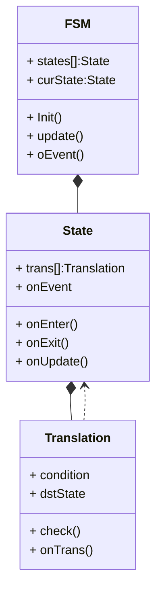

##

### FSM



```lua
function EventHandler:__ctor()
	self.events = {}
end
function EventHandler:addHandler(etype, callback)
	if self.events[etype] then
    	Log.alert('event conflict', etype)
    end
    self.events[etype] = callback
end
function EventHandler:onEvent(e)
	local handler = self.events[e.etype]
    if not handler then return end
    handler.callback()
end

function FSM:__ctor(states, startState, eventMap)
	self.states = states
    self:goto(startState)
end
function FSM:onUpdate()
	self.curSate:onUpdate()
end
function FSM:onEvent(e)
	self.curState:onEvent(self, e)
    self.ev:onEvent(e)
end
function FSM:goto(state)
	Log.assert(state, )
	if self.curState then
		self.curState:onExit()
    end
    self.curState = state
    self.curState:onEnter()
end

function State:onUpdate(vm)
	for i, trans in ipairs(self.trnas) do
    	if trans:check(vm, self) then
        	vm:goto(trans.state)
        	return
        end
    end
end
function State:onEvent(vm, e)
end

```