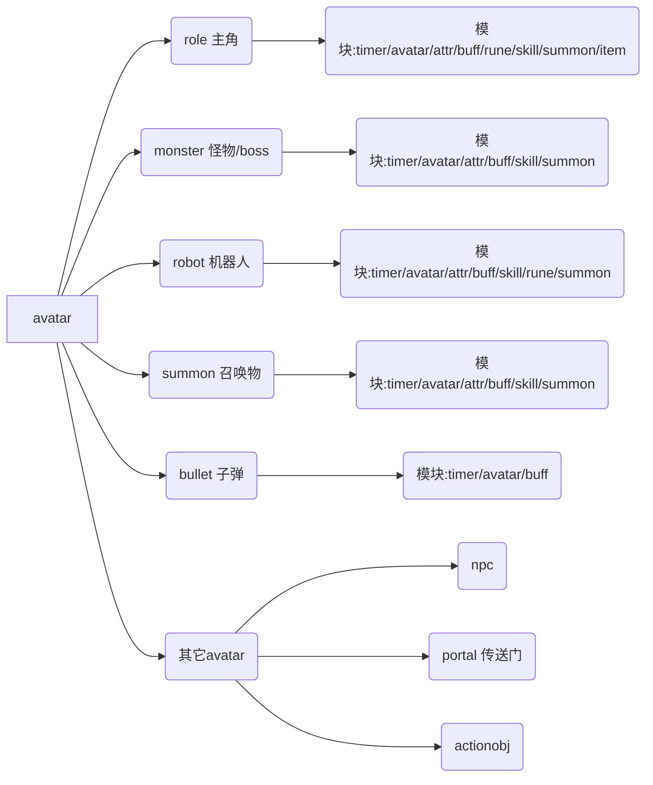

Core:
	Player
	Sprite
    	AnimSprite
    	Tile
    	Chara
        	Enemy
            Actor
        Widget
        	Window
            Button
            	ComboButton
            Text
            InputText
            ScrollPanel

